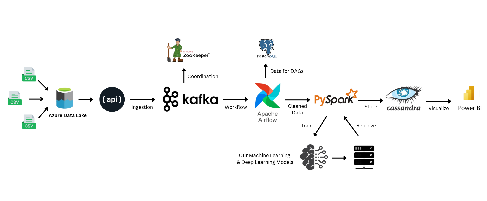

# Data Pipeline

[](https://www.youtube.com/watch?v=cBJ_ivrfQIY)

> 🎥 Click the image above to watch the full project explanation on YouTube!  

---


## **Overview**
This project is a **real-time data pipeline** designed to handle high-velocity streaming data efficiently using **Kafka, Apache Airflow, Cassandra, PostgreSQL, and Docker**. The pipeline integrates multiple sources, processes the data, and stores it for further analysis.  

---

## **Tech Stack**
- **Apache Kafka** - Real-time data streaming  
- **Apache Airflow** - Orchestration & scheduling  
- **PostgreSQL** - Relational database storage  
- **Cassandra** - NoSQL distributed database  
- **Docker** - Containerized deployment  
- **Python** - Data processing & automation  
- **Pandas, NumPy** - Data manipulation  
- **REST API** - Data ingestion & interaction  

---

## **Setup & Installation**
### **Clone the Repository**
```bash
git clone https://github.com/your-username/your-repo.git
cd your-repo
```

### **Set Up a Virtual Environment (Recommended)**
```bash
python -m venv venv
source venv/bin/activate  # Mac/Linux
venv\Scripts\activate     # Windows
```

### **Install Dependencies**
```bash
pip install -r requirements.txt
```

### **Configure Environment Variables**
1. Create a `.env` file inside the `config/` directory.
2. Add the following variables:
   ```ini
   KAFKA_BROKER=localhost:9092
   POSTGRES_USER=airflow
   POSTGRES_PASSWORD=airflow
   POSTGRES_DB=airflow
   ```

---

## **Running the Project with Docker**
### **Start Kafka, Airflow, and Other Services**
```bash
docker-compose up --build -d
```
### **Access Services**
- **Airflow UI:** `http://localhost:8080` (Username: `airflow`, Password: `airflow`)
- **PostgreSQL:** `localhost:5432`
- **Kafka UI:** `http://localhost:9000`

---

## **How It Works**
1. **Data Ingestion**: Data is streamed in real-time using Kafka Producers.  
2. **Data Processing**: Airflow DAGs process and clean the incoming data.  
3. **Storage**: Processed data is stored in **PostgreSQL** and **Cassandra**.  
4. **Visualization & Analysis**: Data can be queried for analytics & monitoring.  

---

## **Need Help?**
For any issues or queries, feel free to **open an issue** or reach out on **[LinkedIn](https://www.linkedin.com/in/badalprasadsingh/)**